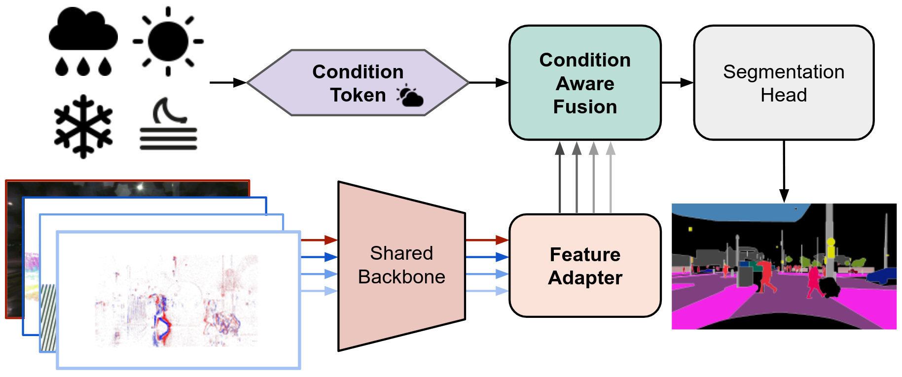

# CAFuser: Condition-Aware Multimodal Fusion for Robust Semantic Perception of Driving Scenes

**by [Tim Broedermann](https://people.ee.ethz.ch/~timbr/), [Christos Sakaridis](https://people.ee.ethz.ch/csakarid/), [Yuqian Fu](https://scholar.google.ch/citations?user=y3Bpp1IAAAAJ&hl=de&oi=ao), and [Luc Van Gool](https://scholar.google.de/citations?user=TwMib_QAAAAJ&hl=en)**


**[[Paper]](https://ieeexplore.ieee.org/document/10858375)**
**[[arXiv]](https://arxiv.org/pdf/2410.10791)**

:bell: **News:**

* [2025-04-11] Code and models are released.
* [2025-01-11] We are happy to announce that CAFuser was accepted in the **IEEE Robotics and Automation Letters**.


## Overview

This repository contains the official code for the **RA-L 2025** paper [CAFuser: Condition-Aware Multimodal Fusion for Robust Semantic Perception of Driving Scenes](https://arxiv.org/pdf/2410.10791).
CAFuser is a condition-aware multimodal fusion architecture designed to enhance robust semantic perception in autonomous driving. It employs a **Condition Token (CT)**, dynamically guiding the fusion of multiple sensor modalities to optimize performance across diverse scenarios. To train the CT, a **verbo-visual contrastive loss** aligns it with semantic environmental descriptors, enabling direct prediction from RGB features. 
The **Condition-Aware Fusion** module uses the CT to adaptively fuse sensor data based on environmental context.
Further, CAFuser introduces modality-specific feature adapters, aligning inputs from different sensors into a shared latent space, and integrates these without loss of performance with a single shared backbone.
CAFuser ranks **first on the public [MUSES](https://muses.vision.ee.ethz.ch/) benchmarks**, achieving 59.7 PQ for multimodal panoptic and 78.2 mIoU for semantic segmentation and also sets the new state of the art on [DeLiVER](https://github.com/jamycheung/DELIVER).




### Contents

1. [Installation](#installation)
2. [Prepare Datasets](#prepare-datasets)
4. [Training](#training)
5. [Evaluation](#evaluation)
6. [Citation](#citation)
5. [Acknowledgments](#acknowledgments)


### Installation

- We use Python 3.9.18, PyTorch 2.3.1, and CUDA 11.8.
- We use Detectron2-v0.6.
- For complete installation instructions, please see [INSTALL.md](INSTALL.md).

### Prepare Datasets

- CAFuser support two datasets: [MUSES](https://muses.vision.ee.ethz.ch/download) and [DeLiVER](https://github.com/jamycheung/DELIVER). The datasets are assumed to exist in a directory specified by the environment variable `DETECTRON2_DATASETS`. Under this directory, detectron2 will look for datasets in the structure described below, if needed.

```text
$DETECTRON2_DATASETS/
    muses/
    deliver/
```

- You can set the location for builtin datasets by `export DETECTRON2_DATASETS=/path/to/datasets`. If left unset, the default is `./datasets` relative to your current working directory.
- For more details on how to prepare the datasets, please see [detectron2's documentation](https://detectron2.readthedocs.io/tutorials/datasets.html).

[MUSES](https://muses.vision.ee.ethz.ch/download) dataset structure:

You need to dowload the following packages from the MUSES dataset:
- RGB_Frame_Camera_trainvaltest
- Panoptic_Annotations_trainval
- Semantic_Annotations_trainval
- Event_Camera_trainvaltest
- Lidar_trainvaltest
- Radar_trainvaltest
- GNSS_trainvaltest

and place them in the following structure:

```text
$DETECTRON2_DATASETS/
    muses/
        calib.json
        gt_panoptic/
        frame_camera/
        lidar/
        radar/
        event_camera/
        gnss/
```

[DeLiVER](https://github.com/jamycheung/DELIVER) dataset structure:

You can download the DeLiVER dataset from the following [link](https://drive.google.com/file/d/1P-glCmr-iFSYrzCfNawgVI9qKWfP94pm/view?usp=share_link) and place it in the following structure:

```text
$DETECTRON2_DATASETS/
    deliver/
        semantic/
        img/
        lidar/
        event/
        hha/
```

### Training

- We train CAFuser using 4 NVIDIA TITAN RTX GPUs with 24GB memory each.
- For further details on training, please look at the [OneFormer getting started](https://github.com/SHI-Labs/OneFormer/blob/main/GETTING_STARTED.md) and the [getting Started with Detectron2](https://github.com/facebookresearch/detectron2/blob/master/GETTING_STARTED.md)
- We provide a script `train_net.py`, that is made to train all the configs provided in CAFuser.
- We further provide a dummy script `slurm_train.sh` to run the training on a SLURM cluster. Adjust the scripts at all places marked with `TODO`'s to your needs.

Download [swin tiny](https://github.com/SwinTransformer/storage/releases/download/v1.0.0/swin_tiny_patch4_window7_224.pth) in the `pretrained` folder and convert it to a detectron2 compatible format:
```bash
mkdir pretrained
wget -P pretrained https://github.com/SwinTransformer/storage/releases/download/v1.0.8/swin_tiny_patch4_window7_224_22k.pth
python tools/convert-pretrained-model-to-d2.py pretrained/swin_tiny_patch4_window7_224_22k.pth pretrained/swin_tiny_patch4_window7_224_22k.pkl
rm pretrained/swin_tiny_patch4_window7_224_22k.pth
```

Training CAFuser on MUSES dataset:
```bash
python train_net.py --dist-url 'tcp://127.0.0.1:50163' \
    --num-gpus 4 \
    --config-file configs/muses/swin/cafuser_swin_tiny_bs8_180k_muses_clre.yaml \
    OUTPUT_DIR output/cafuser_swin_tiny_bs8_180k_muses_clre \
    WANDB.NAME cafuser_swin_tiny_bs8_180k_muses_clre
```

Training CAFuser on DeLiVER dataset:
```bash
python train_net.py --dist-url 'tcp://127.0.0.1:50164' \
    --num-gpus 4 \
    --config-file configs/deliver/swin/cafuser_swin_tiny_bs8_200k_deliver_clde.yaml \
    OUTPUT_DIR output/cafuser_swin_tiny_bs8_200k_deliver_clde \
    WANDB.NAME cafuser_swin_tiny_bs8_200k_deliver_clde
```

### Evaluation

- We provide [pre-trained weights](https://drive.google.com/drive/folders/1babLKkFGw-KX84J4_VREVTTv9bsTOiBh?usp=sharing) for CAFuser on MUSES and DeLiVER datasets. We provide models for both the standard **CAFuser** (CA<sup>2</sup>) and **CAFuser-CAA** variants. The models are trained on the MUSES dataset and the DeLiVER dataset, respectively.
- To evaluate a model's performance, use:

MUSES (on the validation set):
```bash
python train_net.py \
    --config-file configs/muses/swin/cafuser_swin_tiny_bs8_180k_muses_clre.yaml \
    --eval-only MODEL.IS_TRAIN False MODEL.WEIGHTS <path-to-checkpoint> \
    DATASETS.TEST_PANOPTIC "('muses_panoptic_val',)" \
    MODEL.TEST.PANOPTIC_ON True MODEL.TEST.SEMANTIC_ON True
```

Predict on the test set to upload to the [MUSES benchmark](https://muses.vision.ee.ethz.ch/benchmarks#panopticSegmentation) for both semantic and panoptic segmentation:
```bash
python train_net.py \
    --config-file configs/muses/swin/cafuser_swin_tiny_bs8_180k_muses_clre.yaml \
    ----inference-only MODEL.IS_TRAIN False MODEL.WEIGHTS <path-to-checkpoint> \
    OUTPUT_DIR output/cafuser_swin_tiny_bs8_200k_deliver_clde \
    DATASETS.TEST_PANOPTIC "('muses_panoptic_test',)" \
    MODEL.TEST.PANOPTIC_ON True MODEL.TEST.SEMANTIC_ON True
```

This will create folders under `<OUTPUT_DIR>/inference` for the semantic and panoptic predictions (e.g. `output/cafuser_swin_tiny_bs8_200k_deliver_clde/inference/...`).
- For the panoptic predictions, you can zip the `labelIds` folder under the `panoptic` folder and upload it to the MUSES benchmark.
- For the semantic predictions, you can zip the `labelTrainIds` folder under the `semantic` folder and upload it to the MUSES benchmark. 

For better visualization you can further set `MODEL.TEST.SAVE_PREDICTIONS.CITYSCAPES_COLORS True` to get additional folders with the predictions in the cityscapes colors.

DeLiVER on the test set:
```bash
python train_net.py \
    --config-file configs/deliver/swin/cafuser_swin_tiny_bs8_200k_deliver_clde.yaml \
    --eval-only MODEL.IS_TRAIN False MODEL.WEIGHTS <path-to-checkpoint> \
    DATASETS.TEST_SEMANTIC "('deliver_semantic_test',)"
```

Replace `deliver_semantic_test` with `deliver_semantic_val` to evaluate on the validation set.


### Results

We provide the following results for the MUSES dataset, with the testing score from the official [MUSES Benchmark](https://muses.vision.ee.ethz.ch/benchmarks#panopticSegmentation):

| Method | Backbone | PQ-val | mIoU-val  | PQ-test | mIoU-test |                                   config                                    | Checkpoint |
| :---:  | :---:    |:------:|:---------:|:-------:|:---------:|:---------------------------------------------------------------------------:| :---: |
CAFuser | Swin-T | 59.26  |   78.71   |  59.7   |   78.2    |   [config](configs/muses/swin/cafuser_swin_tiny_bs8_180k_muses_clre.yaml)   | [model](https://drive.google.com/file/d/10uiIjNb0OzHbEDZPu13D73X-JxMbp5XO/view?usp=sharing) |
CAFuser-CAA | Swin-T | 59.35  |   79.04    |  59.5   |   78.43    | [config](configs/muses/swin/cafuser_swin_tiny_bs8_180k_muses_clre_caa.yaml) | [model](https://drive.google.com/file/d/1Hjp1lrc4T-aRZAiS3qzqLQ92w3feMqU9/view?usp=sharing) |

We provide the following results for the DeLiVER dataset:

| Method | Backbone | mIoU-val | mIoU-test |                                     config                                      | Checkpoint |
| :---:  | :---:    |:--------:|:---------:|:-------------------------------------------------------------------------------:| :---: |
CAFuser | Swin-T |  68.12   |   55.80   |   [config](configs/deliver/swin/cafuser_swin_tiny_bs8_200k_deliver_clde.yaml)   | [model](https://drive.google.com/file/d/13Efu0tBx5j8ffeN7KPthnwvL0kBjdlsG/view?usp=sharing) |
CAFuser-CAA | Swin-T |  68.79   |   55.38   | [config](configs/deliver/swin/cafuser_swin_tiny_bs8_200k_deliver_clde_caa.yaml) | [model](https://drive.google.com/file/d/1qdymOi3uFruBA8jWyUm-3lsOyYT6Hge5/view?usp=sharing) |


### Citation

If you find this project useful in your research, please consider citing:

```
@article{broedermann2024cafuser,
  author={Br{\"o}dermann, Tim and Sakaridis, Christos and Fu, Yuqian and Van Gool, Luc},
  journal={IEEE Robotics and Automation Letters}, 
  title={CAFuser: Condition-Aware Multimodal Fusion for Robust Semantic Perception of Driving Scenes}, 
  year={2025},
  volume={10},
  number={4},
  pages={3134-3141},
  keywords={Sensors;Sensor fusion;Semantics;Adaptation models;Cameras;Feature extraction;Laser radar;Radar;Meteorology;Semantic segmentation;Sensor fusion;semantic scene understanding;computer vision for transportation;deep learning for visual perception;multimodal semantic perception},
  doi={10.1109/LRA.2025.3536218}}
```

### Acknowledgments

This project is based on the following open-source projects. We thank their
authors for making the source code publicly available.

* [OneFormer](https://github.com/SHI-Labs/OneFormer)
* [Mask2Former](https://github.com/facebookresearch/Mask2Former)
* [GroupViT](https://github.com/NVlabs/GroupViT) 
* [Neighborhood Attention Transformer](https://github.com/SHI-Labs/Neighborhood-Attention-Transformer)
* [detectron2](https://github.com/facebookresearch/detectron2)
* [MUSES SDK](https://github.com/timbroed/MUSES)
* [HRFuser](https://github.com/timbroed/HRFuser)

This work was supported by the [ETH Future Computing Laboratory (EFCL)](https://efcl.ethz.ch/), financed by a donation from Huawei Technologies.